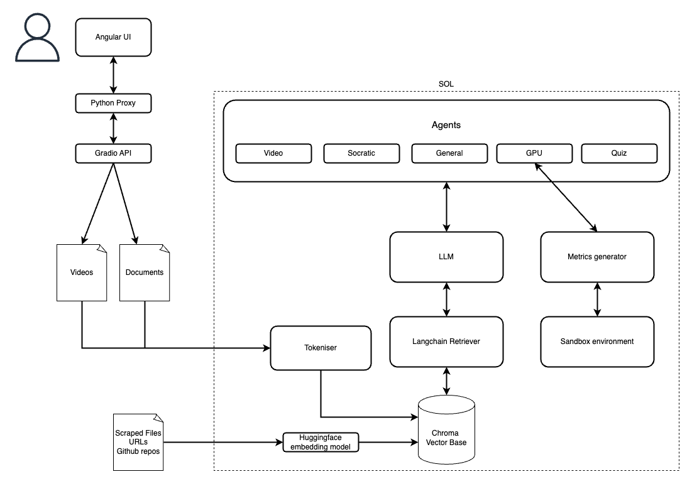

# 80++ – Accelerated Learning System for Data Science

Presenting 80++ our AI-powered tutor designed to accelerate GPU-based data science education. From document comprehension to hands-on benchmarking, our 5-mode bot delivers personalized learning experiences to help students transition from theory to performance-driven practice.

Developed as part of the **AI Spark Challenge** with NVIDIA and AZNext.


---

### Mode-Based AI Tutoring
- **Video Tutor**  
  Fetches and summarizes relevant tutorial videos from trusted sources (e.g., NVIDIA YouTube, technical conference talks).

- **Socratic Tutor**  
  Encourages learners to reason through questions via guided prompts rather than direct answers.

- **General Assistant**  
  Provides concise, code-ready answers and explanations for technical topics in ML, data science, and programming.

- **GPU Accelerator**  
  Helps users convert CPU-bound code (e.g., NumPy, Pandas) to GPU-accelerated versions using CuPy, cuDF, etc. Includes benchmarking tools.

- **Quiz Mode**  
  Time-bound 10-question multiple-choice quizzes with instant scoring, answer explanations, weak point analysis, and upskilling recommendations.

---

## Architecture Overview


* Frontend: Angular UI (Netlify-hosted)
* Backend:Flask (Python)
* LLM Agent: Ollama
* Document Ingestion: LangChain loaders + vector chunking
* Knowledge Source: NVIDIA documents, YouTube transcripts, benchmark papers
* Persistence: FAISS vector store + user session DB



---

## Project Structure

```
├── backend/
│   ├── MultiModal Tutor Agent.ipynb
├── src (Angular front end)
├── proxy/
│   └── gradio.py
├── architecture-diagram.png
├── deploy-instructions.md
└── README.md
```

---

## Local Development Setup

### Prerequisites

* Node.js (v18+)
* Python 3.10+
* Angular CLI
* Ollama installed locally or connected via API
* FAISS or Chroma setup for vector storage

For the hackathon we got access to the SOL supercomputer in ASU which hosted Ollama and the other infra.

### Quickstart

```bash
# Start frontend
npm install
ng serve


# Start middleware
cd proxy/
pip install -r requirements.txt
python gradio.py

# Start backend by starting the notebook present in /backend
```


## Demo Walkthrough
If the video is still up, here is the [youtube link](https://www.youtube.com/watch?v=TofwOV7kyKU).


## The Team
* [Anannya Reddy Gade](https://anannyareddy22.github.io/)
* [Ben Stewart Silas Sargunam](    https://github.com/sbenstewart)
* [Neha Kashyap](www.linkedin.com/in/nkashya4)
* [Sayantika Paul](https://github.com/SayantikaPaul-12)
* [Teja Vishnu Vardhan Boddu](https://github.com/btvvardhan)

---

<br>
<br>
<b>Have a great day:)</b>